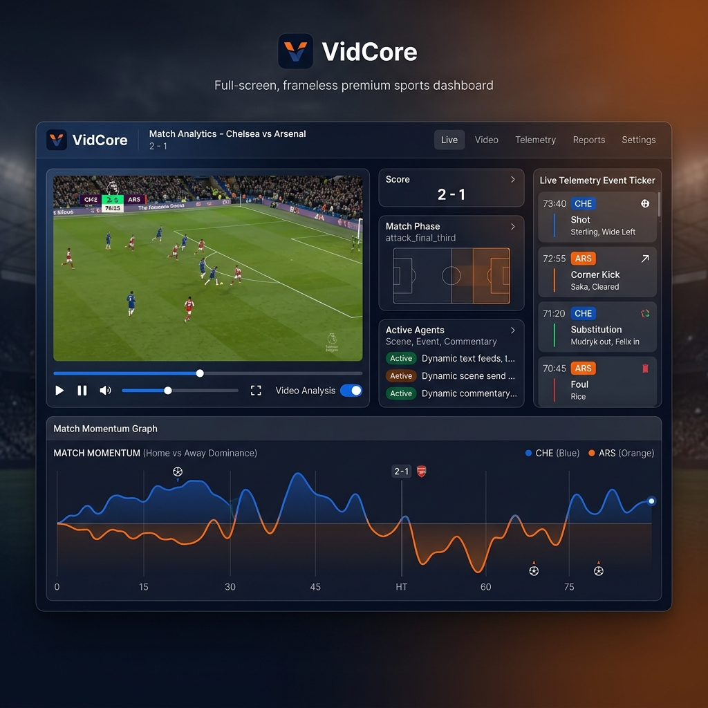

<div align="center">
  

  # 🎥 VidCore — Multi-Agent AI Sports Video Analysis

  <p>
    <em>LLM-powered pipeline that watches sports videos, detects key events,<br/>generates commentary, and produces highlight reels — all in real time.</em>
  </p>

  <p>
    
    
    
    
    
    
  </p>
</div>

---

## 📖 Overview

VidCore is a **multi-agent LLM orchestration framework** for sports video intelligence. It samples frames from a video, routes them through specialized vision-language agents (scene detection, event detection, scoreboard OCR, tactical reasoning, commentary, summarization), and produces structured match reports, interactive timelines, and automatically cut highlight reels.

**Why it's different:** Adaptive agent routing skips LLM calls on generic play frames, calling the full pipeline only on key moments. This eliminates ~70% of LLM invocations while preserving accuracy.

Built on **Qwen3-VL-32B** via vLLM, with a premium real-time WebSocket dashboard for live monitoring.

---

## ✨ Key Features

| Capability | Description |
|---|---|
| 🏟️ **Sport Classification** | Auto-detects football, cricket, basketball, tennis, rugby, baseball, hockey, volleyball, F1 |
| 🎬 **Video Type Detection** | Classifies full match, highlights, press conference, training, broadcast B-roll, graphic overlay |
| 🧠 **Multi-Agent Pipeline** | 12 specialized VLM agents — scene, event, scoreboard, reasoning, commentary, summary, highlight, timeline, geo, sport, video, and sport-specific event detectors |
| ⚡ **Adaptive Routing** | Skips event detection on generic play; fires full pipeline only on key moments (goals, fouls, wickets, etc.) |
| 📊 **Live Scoreboard OCR** | Reads match score from broadcast overlays every 5th frame via cropped region + VLM |
| 🗣️ **AI Commentary** | Natural-language commentary with tactical reasoning on detected events |
| ✂️ **Highlight Reels** | Auto-cut clips in 4 flavors — All Events, Goals Only, Drama, Social (9:16 vertical) |
| 📑 **Structured Reports** | Markdown match reports + CSV timeline exports |
| 🌐 **Live Dashboard** | Premium dark-themed WebSocket dashboard with momentum graphs, pitch visualizer, live event ticker, multi-agent telemetry |
| 🔌 **REST API** | FastAPI server with `/analyze`, `/stream`, `/reel`, `/report` endpoints + upload support |
| 🎯 **YOLO Integration** | Object detection and ball/player tracking via Ultralytics |

---

## 🏗️ Architecture

```
                         ┌────────────────────────────────┐
                         │        VidCore Dashboard        │
                         │   WebSocket / SSE / REST API    │
                         └──────────────┬─────────────────┘
                                        │
                         ┌──────────────▼─────────────────┐
                         │    VideoOrchestrator (core)     │
                         │                                 │
                         │  ┌───────────────────────────┐  │
                         │  │      AgentRouter           │  │
                         │  │  (adaptive skip logic)     │  │
                         │  └───────────┬───────────────┘  │
                         │              │                   │
                         │  ┌───────────▼───────────────┐  │
                         │  │   Agent Pipeline (12 agents)│  │
                         │  │  Scene → Event → Reasoning  │  │
                         │  │     → Commentary → Summary  │  │
                         │  │     → Highlight → Timeline  │  │
                         │  └───────────┬───────────────┘  │
                         │              │                   │
                         │  ┌───────────▼───────────────┐  │
                         │  │     VLLMClient              │  │
                         │  │  (OpenAI-compatible API)    │  │
                         │  └───────────┬───────────────┘  │
                         └──────────────┼─────────────────┘
                                        │
                         ┌──────────────▼─────────────────┐
                         │        vLLM Inference           │
                         │   Qwen/Qwen3-VL-32B-Instruct    │
                         └────────────────────────────────┘
```

### Agent Pipeline Flow

```
Video Frame
    │
    ├── Sport Classifier ────► "football"
    ├── Video Classifier ────► "full_match"
    ├── Geo Agent ───────────► "Old Trafford, Premier League"
    │
    ▼ (every frame)
  Scene Detector ─────────► "ball at midfield, player running, scoreboard 2-1"
    │
    ▼ (adaptive — skips generic play)
  Event Detector ─────────► "GOAL: striker heads ball into net, 35th minute"
    │
    ▼ (on key event)
  Scoreboard Agent ───────► "Home 2 : 1 Away"
    │
    ▼ (on key event)
  Reasoning Agent ────────► "Counter-attack caught defense out of position..."
  Commentary Agent ───────► "What a brilliant header! The striker rises above..."
    │
    ▼ (end of match)
  Summary Agent ──────────► Match report
  Highlight Agent ────────► Top 10 key moments
  Timeline Agent ─────────► Frame-by-frame event log
```

---

## 🚀 Quick Start

### Prerequisites

- **Python 3.10+**
- **vLLM** running with `Qwen/Qwen3-VL-32B-Instruct` (GPU recommended: 24GB+ VRAM)
- **FFmpeg** (for video processing)

### 1. Clone & Setup

```bash
git clone https://github.com/UmairBaig8/VisionCore.git
cd VisionCore

python3 -m venv .venv
source .venv/bin/activate

pip install -r requirements.txt
```

### 2. Install vLLM

```bash
# GPU (recommended)
pip install vllm

# CPU-only (slow)
pip install vllm --extra-index-url https://download.pytorch.org/whl/cpu
```

### 3. Start vLLM Server

```bash
vllm serve Qwen/Qwen3-VL-32B-Instruct \
  --host 0.0.0.0 \
  --port 8000 \
  --dtype auto \
  --max-model-len 32768 \
  --gpu-memory-utilization 0.90
```

### 4. Analyze a Video

```bash
# Drop a video in videos/ and run:
python main.py analyze videos/your_match.mp4 -d full -i 0.5 --live --reel
```

### 5. Launch the Dashboard

```bash
python api_server.py
# Open http://localhost:9000/dashboard
```

> **One-shot setup:** `./scripts/setup.sh` automates steps 1–3.

---

## 📋 CLI Reference

```bash
# Full analysis with highlight reel generation
python main.py analyze videos/match.mp4 -d full --live --reel

# Fast mode (scene + events only, no reasoning/commentary)
python main.py analyze videos/match.mp4 -d fast -i 1.0

# Real-time streaming with live dashboard
python main.py stream videos/match.mp4 --live

# Generate highlight reel from existing analysis
python main.py reel videos/match.mp4 --flavor social --player "Messi"

# List available videos, agents, skills
python main.py videos
python main.py agents
python main.py skills

# Validate environment
python main.py doctor

# Show runtime config
python main.py config
```

| Flag | Description |
|---|---|
| `-d, --depth` | Analysis depth: `scene-only`, `fast`, `full` |
| `-i, --interval` | Frame sampling interval in seconds (default: `0.5`) |
| `-l, --live` | Real-time wall-clock sampling |
| `--reel` | Generate highlight reels after analysis |
| `--flavor` | Reel flavor: `all`, `goals`, `drama`, `social` |
| `--player` / `--team` | Filter clips by player or team name |

---

## 🔌 API Endpoints

| Method | Endpoint | Description |
|---|---|---|
| `GET` | `/dashboard` | Live analysis dashboard |
| `GET` | `/demo` | Standalone demo (no vLLM needed) |
| `GET` | `/docs` | OpenAPI docs (Swagger) |
| `POST` | `/analyze` | Start video analysis job |
| `POST` | `/upload` | Upload video to `videos/` |
| `POST` | `/reel/{video_name}` | Generate highlight reel |
| `GET` | `/report/{video_name}` | Get Markdown match report |
| `GET` | `/timeline/{video_name}` | Get timeline CSV |
| `GET` | `/output/{filename}` | Serve generated files |
| `GET` | `/videos` | List available videos |
| `WS` | `/ws/{video_name}` | WebSocket live analysis stream |

---

## ⚙️ Configuration

Edit `config.yaml`:

```yaml
vllm_endpoint: http://localhost:8000/v1/chat/completions
model: Qwen/Qwen3-VL-32B-Instruct
sample_interval: 0.5
```

| Key | Description |
|---|---|
| `vllm_endpoint` | vLLM OpenAI-compatible chat completions URL |
| `model` | Model ID (any vision-language model supported by vLLM) |
| `sample_interval` | Seconds between frames sampled for analysis |

---

## 🧪 Running Tests

```bash
python tests.py              # Full suite (requires vLLM)
python tests.py --quick      # Skip LLM connectivity checks
python test_api.py           # API smoke tests
```

---

## 🗂️ Project Structure

```
VidCore/
├── core/                    # Engine (orchestrator, router, LLM client, config)
├── agents/                  # VLM prompt templates (12+ agents as .md files)
├── skills/                  # Utility modules (sampler, encoder, reel builder)
├── static/                  # Web dashboard (HTML/CSS/JS + Chart.js)
├── scripts/                 # Setup and utility scripts
├── videos/                  # Input video directory
├── output/                  # Generated reports, CSVs, highlight reels
├── main.py                  # CLI entry point
├── cli.py                   # Typer CLI commands
├── api_server.py            # FastAPI + WebSocket server
├── live_detect.py           # YOLO webcam detection demo
├── config.yaml              # Runtime configuration
└── tests.py                 # Test suite
```

---

## 🛠️ Tech Stack

| Layer | Technology |
|---|---|
| **Orchestration** | Python, Typer CLI |
| **API & Streaming** | FastAPI, Uvicorn, WebSockets, SSE |
| **Vision Model** | Qwen/Qwen3-VL-32B-Instruct via vLLM |
| **Object Detection** | Ultralytics YOLO (yolo11n, yolo26n) |
| **Video Processing** | OpenCV (cv2) |
| **Dashboard** | Vanilla JS, Chart.js, Canvas API |
| **Fonts** | Inter, Outfit (Google Fonts) |
| **Config** | YAML |

---

## 🤝 Supported Sports

Football (Soccer) · Cricket · Basketball · Tennis · Rugby · Baseball · Hockey · Volleyball · Formula 1

Each sport has its own event detection prompts in `agents/sports/`.

---

## 📄 License

This project is licensed under the **MIT License** — see the [LICENSE](LICENSE) file for details.

---

## 🙏 Acknowledgments

- [vLLM](https://github.com/vllm-project/vllm) — High-throughput LLM serving
- [Qwen](https://github.com/QwenLM/Qwen) — Vision-language model
- [Ultralytics](https://github.com/ultralytics/ultralytics) — YOLO object detection
- [FastAPI](https://fastapi.tiangolo.com/) — Modern Python web framework

---

<div align="center">
  <sub>Built with ❤️ by <a href="https://github.com/UmairBaig8">Umair Baig</a></sub>
</div>
